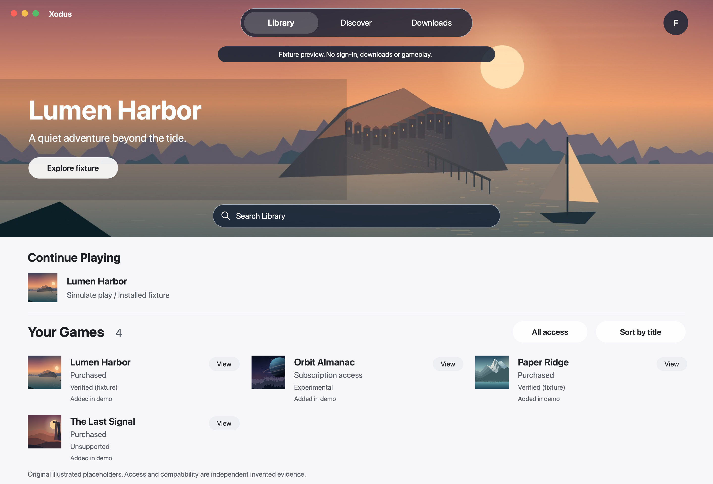

# Xodus for Mac

A native Mac launcher in development for legitimately entitled Xbox PC games, integrating with the Xodus management engine.

**Current status: native development app, not a complete game launcher.** The default SwiftUI/AppKit app has a real bounded management client, isolated Microsoft Store sign-in integration, source-backed PC Game Pass discovery and Microsoft Store network search, edition detail, activity and scoped installed-registry status. A native folder picker also supports a read-only marker check in one explicitly selected game folder; observed header identifiers never become retail identity, registration or permission to launch. A packaged development build includes its matching engine and connects without Terminal setup; negotiated capabilities determine which actions work. Search coverage is explicitly partial, and public results never establish ownership. A controlled development pair has completed human sign-in and retained saved-session status across a normal app restart. Authenticated provider reads, authoritative owned-PC inventory, authorized game installation and certified gameplay remain active verification/implementation gaps. Saved sign-in is **not** proof of PC ownership or package access.

The original offline demonstration is **nonshipping only**. `XODUS_SHIPPING=1`
compiles out its views, invented state, artwork, resources and check/export
entrypoints. Shipping screens use native setup/empty/loading/error states and
actual public product data, not synthetic game illustrations. See
[native integration status and evidence](docs/NATIVE-INTEGRATION.md).



## Explore the foundation

| Artifact | Purpose |
| --- | --- |
| [Product](PRODUCT.md) | Audience, scope, principles and undecided product choices |
| [Design](DESIGN.md) | Native visual direction, tokens, interaction and original mockups |
| [Requirements](docs/REQUIREMENTS.md) | Traceable requirements and measurable acceptance criteria |
| [UX flows](docs/UX-FLOWS.md) | Screens, cancellation, loading, degraded and recovery states |
| [Architecture](docs/ARCHITECTURE.md) | SwiftUI/AppKit boundary, Rust adapter and trust model |
| [Backend contract](docs/BACKEND-CONTRACT.md) | Pinned scoped management protocol and future lifecycle requirements |
| [Runtime providers](docs/RUNTIME-PROVIDERS.md) | Four declared presets and separately versioned, configuration-only planning |
| [Native integration](docs/NATIVE-INTEGRATION.md) | Actual native client, developer app bundle, limitations and producer pin |
| [Research and decisions](docs/RESEARCH.md) | Evidence, leads, uncertainties and decision register |
| [Milestones](docs/MILESTONES.md) | Release gates; prototype is not a production milestone |
| [Implementation ledger](docs/IMPLEMENTATION-LEDGER.md) | Durable v1 work IDs, actual-vs-fixture status, dependencies, evidence and blockers |
| [Editable mockups](design/README.md) | Original SVG screens, shared tokens and reproduction |

Design collaboration: [nine editable v0.2 Figma mockups](https://www.figma.com/design/5iQu716UFImHjRxJkf0t8V?node-id=3-115) and [editable FigJam UX flow](https://www.figma.com/board/3MejlFaXHkogmJ3J5k79Gw). Revised Library/Discover renders were inspected; [import status](design/README.md) records static SVG fidelity limits and superseded v0.1. These are proposed designs, not implemented APIs, exact compositor effects or a wired Figma prototype.

## Run the native development app

On an Apple Silicon Mac with the **Xcode/SDK 27 or newer** toolchain
(tested with Apple Command Line Tools, Swift 6.4 and SDK 27.0):

```sh
swift run XodusFixtureChecks
swift run XodusPreview
```

The historical SwiftPM executable name remains `XodusPreview`; its default is now the live development shell, **not simulated gameplay**. Source-only development can select a trusted engine in Advanced Settings or explicitly use `XODUS_BACKEND_PATH`. A packaged build uses its included engine automatically; a missing/nonexecutable included engine shows an actionable error rather than silently using a saved external build or convincing fixtures. There is no interactive-CLI scraping or arbitrary Wine picker. The main launcher never receives credentials; the isolated Swift authentication host handles only its private memory-only handoff, not credential storage or cryptography.

Build a controlled local `.app` only after independent source and sealed-input
approval; placeholders below are required operator pins, not values to guess:

```sh
sh tools/build_app.sh /absolute/reviewed/engine UNSIGNED_SHA BYTES PROVENANCE_SHA PROVENANCE_BYTES APPROVED_APP_COMMIT APPROVED_APP_TREE /absolute/owned/output
```

The packager verifies independently supplied unsigned CLI/provenance hashes,
sizes, exact approved producer source/tree, release profile and feature sets. It creates
a new stage, separately signs engine/helper, generates stage-only compiled
pair pins and then builds the shipping launcher. The final helper receipt and
signed identities must match those compiler inputs. No engine override, picker,
remembered path or runtime JSON can grant shipping approval. An unpaired shipping
build fails before any engine process. The prior `dist/Xodus.app` is never moved
or replaced. This source tooling is not an executed package, notarization,
distribution attestation or successful human login; deployment/launch require
separate approval. See [controlled pair admission](docs/SHIPPING-ADMISSION.md).

The proposed deployment baseline is **macOS 14**, not a user-approved support commitment. The shared native toolbar groups Library / Discover / Downloads with compact stock `NSSearchField` search: real `.tabs` on macOS 27+, segmented fallback on 14-26. Search expands for editing, Command-F or a retained query; Account stays separate at the trailing edge. The Scene hides the visible title while retaining native traffic lights and app identity. Live screens use the native window background until rights-cleared real artwork exists. Account content scrolls independently of its adaptive action footer, and normal activation remains AppKit-owned. Source/headless evidence is **not deployed or visually confirmed**.

**Official CrossOver, installed separately, is the first-release dependency.**
The app checks only standard app locations, bounded metadata and a fixed
Apple-anchored CodeWeavers signature requirement. A verified installation
defaults a new/unset profile; explicit choices are preserved. Missing/unverified
CrossOver blocks first-release gameplay setup, not public browsing or Microsoft
sign-in. Wine/GPTK and custom graphics remain **Experimental**, with explicit
acknowledgement reset by configuration or observed installation changes.
See [runtime policy and scoped trust source](docs/RUNTIME-PROVIDERS.md).

Wine/graphics versions and hashes remain independent declarations. The separate
bounded `runtime-plan` validates configuration only; it never executes CrossOver,
checks a license, creates a prefix, migrates saves or enables Play. A verified
app signature is not entitlement or game compatibility. The nonshipping fixture
Settings cannot inspect CrossOver or start planning. The controlled development
sign-in result does not qualify this runtime policy for gameplay or distribution.

`XodusAuthHost` implements AppKit/WebKit window ownership and a strict private,
anonymous-channel protocol. Its exact seven-string legacy handoff remains
memory-only; Rust retains proof/SOAP processing and credential commit. Neutral
WebKit and channel checks do not contact Microsoft. The controlled human flow
now reaches saved sign-in, including after restart; passkey coverage and
authenticated provider-read verification remain unqualified.

**Visual revision v0.2 supersedes the unapproved flat v0.1 concepts.** SVGs describe editable layout and intended glass placement, not live compositor refraction. Native own-view exports also cannot establish backdrop/refraction fidelity; the native implementation, not an SVG blur, owns system Glass.

For the original offline design demonstration:

```sh
swift run XodusPreview --fixture
```

In that nonshipping mode, choose **Library / Discover / Downloads**, search within the current scope, open an invented game, and use **Simulate install** or **Simulate next step**. Fixture Settings inject empty, partial, stale, offline and cancelled-auth scenarios. Simulated jobs exist only in memory and reset on relaunch. Fixture mode never contacts the engine, opens sign-in or writes a game registry. There is no live Settings transition to preview; start it explicitly as a separate nonshipping invocation.

```sh
swift run XodusPreview --self-check
```

Core, presentation and `swift run XodusManagementChecks` are dependency-free executables. Presentation checks also allocate native search controls and lay out synthetic Account content in detached `NSHostingView` instances: no window is shown, no provider is loaded and no backend connects. They do not render or capture an existing app. Management checks use the producer's sanitized fixtures plus real mock child processes to exercise negotiation, framing, EOF/timeouts/exit failures, request correlation and activity reconciliation. They do not sign in or approve Keychain access. Command Line Tools do not include XCTest/Swift Testing on the tested Mac. [Verification](docs/VERIFICATION.md) records actual evidence separately from future release criteria.

`swift run XodusPreview --live-check` exercises the actual native session coordinator against synthetic subprocesses: expired-profile recovery, permission failures, transient/late-cancel reconciliation and failed-page continuation. It exits before creating a window and performs no Microsoft or Keychain operation.

Native Settings can preview and save a **counts-only diagnostic summary** through
a native file picker. Only the reviewed summary is saved, not raw engine logs,
account identifiers, tokens, URLs or personal paths. Writes are atomic and run
off the main actor; failures remain explicit. Overlapping disconnect/reconnect
operations share bounded shutdown ownership rather than starting another engine
before the old child exits.

`sh tools/check.sh` runs the native/management/nonshipping-fixture/private-host checks,
portable packaging negatives, actual shipping release compilation and separate
shipping XCTest admission checks. The latter require full Xcode's test framework,
not only Command Line Tools; they never become application entrypoints.
The existing GitHub-hosted `xcode-27` job checks actual SDK/runtime versions and
SVG regeneration. A workflow definition is not evidence of a passing revision.

Own-view exports use `--export-preview <directory>` for fixtures or `--export-live <directory>` for a **disconnected**, non-account live shell. They export this app's Library, Discover and Downloads view hierarchy and exit; they do not capture the desktop/other apps or establish Glass-compositor fidelity.

## Boundaries and licensing

The app is standalone: Heroic does not offer a proven shipping new-store plugin API. Existing Xodus runtime service IPC is **not** the management protocol. The scoped adapter does not resolve authoritative PC ownership, safe package installation or the exactly paired Xbox-capable gameplay runtime.

No private runtime source, credentials, real account data, proprietary game covers, Apple assets or paid design assets are included. The original app source, documentation and mockups are licensed **GPL-3.0-only**, by the user's explicit choice; see [LICENSE](LICENSE) and [licensing boundaries](docs/LICENSING.md). Third-party runtime components/assets retain their own licenses. Dependency redistribution, signing/notarization and installer distribution remain pending. This license does not grant rights to Microsoft packages or runtime components.
