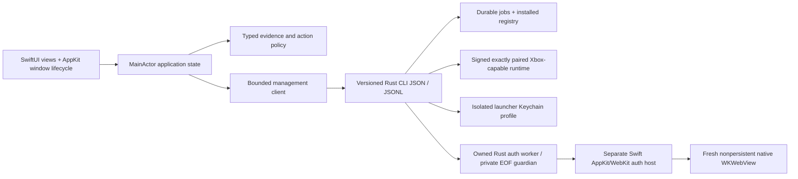

# Architecture

## Boundary

**Implemented:** SwiftPM `XodusCore` typed evidence/fixture policy, a supervised
`XodusManagement` JSONL client, the live `XodusPreview` SwiftUI/AppKit shell,
dependency-free native checks and original scene resources. Explicit fixture
mode never connects an engine. The separately staged `XodusAuthHost` executable
has no management-module dependency; it owns native browser callbacks and the
strict private seven-string handoff, not credentials in the main application.
Its source/headless checks are not a deployed producer pairing or successful
human authentication. Optional explicit exports write only this app's own views.

**Future/gated:** authoritative inventory, authorized installation and a signed,
exactly paired gameplay runtime. Existing `xodus-service` runtime IPC is not
account/catalog/install/queue management. No private Rust source is imported.

## Model and ownership

Runtime declarations use a separate version-one configuration model and
`runtime-plan` subprocess, not a C95 operation or an authentication route.
Four native presets start unselected. Provider, engine and graphics metadata
have independent nullable versions/hashes and provenance. The schema evaluator
is shared, including the provider schema's conditional `else`; duplicate-key
checking happens before Foundation decoding can erase duplicates.
The caller writes bounded stdin then EOF, drains bounded output/diagnostics,
requires clean exit zero and validates the configuration echo plus generation/
configuration-hash relative path before accepting a plan. Cancellation/deadline
cleanup stops and reaps only its owned planning child. No provider path is read,
prefix created, save migrated or installation/device/game evidence promoted.
See [the separately pinned provider contract](RUNTIME-PROVIDERS.md).

Application termination is an app-lifetime fence, not just a management-client
disconnect. It blocks new planning/connect requests, joins cancelled planning
through owned cleanup/reap and composes both shutdown results. A failed
cleanup refuses termination and retains reconciliation ownership; a normal
exit cannot orphan a planning child when the management connection is absent.

`ProductID` identifies a catalog product; edition identity, package identity/version, market, language and architecture remain separate. Entitlement is purchase/subscription/none/unknown, with provenance/time and expiry where supplied. Installability is downloadable/blocked/unknown with a reason and pinned package. Compatibility is verified/experimental/unsupported/unknown with OS/architecture/runtime fingerprint. Local installation has its own version/runtime/state; no boolean `supported` or title-string lookup.

The Rust management layer owns credential proof/SOAP, the isolated Keychain
profile, final atomic credential commit, registry and process supervision.
Future package plans/install promotion remain backend responsibilities. Swift
owns presentation, user intent, connection/session lifecycle and reconciliation.
The private Swift helper alone projects exactly seven issuer strings in memory;
it does not decode issuer tickets, implement proof crypto or write credentials.
Neither UI cache nor a purchase-looking label authorizes an install.

## Concurrency and persistence

Views observe MainActor state. Process I/O is bounded and performed off that actor;
validated updates enter the session coordinator. Sequence/request/job identifiers
reject duplicates and terminal regressions. Restart requests backend snapshots,
not reconstructed percentages. Private helper I/O uses an actor-owned anonymous
duplex descriptor with bounded asynchronous reads/writes, while AppKit/WebKit
delegates stay on MainActor.

The helper inherits the worker's remaining monotonic 600-second budget, never
resets it for a continuation, and closes its owned browser/window on EOF,
cancellation or expiry. The paired Rust change must add an independent
engine-parent EOF guardian throughout async issuance and handoff publication;
the deployed e7 worker does **not** already have that guardian. A shared terminal
fence, matching closed acknowledgement, helper EOF and matching clean exit are
required before Store completion. Engine-only death, write-half retention,
half-close, worker death and completion/publication races remain paired Rust
validation gates, not claims made by Swift-only fixtures.

Registry writes must use a journal/transaction plus atomic rename and fsync strategy proven on the target filesystem. Entries reference manifest-owned paths and exact package/runtime fingerprints. Saves are external to versioned install roots. Crash-recovery reconciliation quarantines unregistered staged content; it never infers an installed game from a directory name.

## Security and privacy

Consumer inventory consent/audience remain unresolved. Native sign-in reuses the
backend's Keychain abstraction, with one credential owner and an isolated
launcher profile; Swift has no second vault. The optional `key-chain-file`
feature must remain forbidden in shipping builds. Existing sign-in does not
establish inventory access.

Tokens belong in Keychain and private authenticated channels, never argv, stdout events, stderr or export logs. Request credentials are passed through an authenticated local broker/anonymous pipe or equivalent narrowly scoped channel. Account switch isolates caches/jobs; entitlement revocation follows backend policy. Existing Xbox Live session scopes and configurable XSTS relying party are useful machinery, not proof of inventory audience. Negotiate/document approved auth audience separately per capability; never reuse one XSTS token everywhere.

The dedicated host receives only an inherited anonymous FD0 socketpair and the
agreed bounded private frames. Provider strings do not enter management frames,
argv, named sockets, files or application logs. Its standard streams are null,
the channel is close-on-exec, and core dumps are disabled process-locally where
supported; this does not promise that OS crash reports are suppressed. The
nonsecret helper path/version/hash binding is explicit, reviewed and bundle
relative before producing an absolute launch path, with no PATH fallback.
Fresh nonpersistent WebKit data, exact trusted HTTPS origins/main frame,
navigation generations/document nonce and one-shot result gates fence callbacks.
Navigation and private-bridge trust are separate. Subframe loads are unrestricted;
top-level navigation accepts only HTTPS/443 without userinfo on the exact or proper
dot-suffix `live.com`, `microsoft.com`, `microsoftonline.com`, `msauth.net`,
`msftauth.net` and `live.net` hosts, rejecting malformed/encoded/IDNA aliases.
Rejected top-level requests cancel only that navigation. Allowed popup requests
load in the same view; an initial `about:blank` popup leaves the current document
and flow intact. There is no secondary browser window or external URL fallback.
Cancellation and provisional WebKit policy interruption (102) are nonterminal;
genuine navigation, renderer and checked-JavaScript errors remain typed failures.
Bridge/DA delivery still requires the original trusted main-frame origin,
generation/document nonce and seven-string shape; wider navigation does not widen
bridge authorization.
Provider notification envelopes may contain extra keys: recognized DA data is
projected to the unchanged exact seven-string private handoff, and the original
fixed `CloudExperienceHost.getContext` request retains its opaque context and
four-argument callback. Other notifications, non-JSON notification strings and
untrusted-frame messages authorize no data and leave the flow alive. Claimed
malformed DA, invalid private wrappers/control generations, document validation
and duplicate handoffs remain failures. This is message tolerance, not broader
origin, method, token or private-channel authority.
Swift ownership alone proves neither Microsoft passkey eligibility nor a fix
for the user's unclassified authenticator obstacle.

Runtime downloads must come from an approved manifest with publisher signature, hash, exact engine pairing, capability version and rollback metadata. Validate archives against path traversal/symlink escape, use bounded managed roots, and fail closed on signature/hash mismatch. No auto-downloading arbitrary Wine. Gatekeeper/notarization, hardened runtime/entitlements and component redistribution need a signed release design, not assumptions.

## Failure semantics

Current CLI interactive package prompts must be replaced with explicit requests. Known outer-success/inner-failure and login-without-token hazards mean exit status alone cannot be trusted. Future requests succeed only with validated success envelope and, for installs, verified terminal job/registry state. EOF, invalid JSON, contradictory results, timeout, nonzero exit and missing mandatory fields are explicit failures; sanitized diagnostics are retained for support.

Fixture state deliberately remains in memory and uses no filesystem mutations. That is not a prototype of durable installation; durability is a separate backend gate with fault injection.

## Build and distribution

Source builds require Xcode 27 or its matching Command Line Tools/macOS SDK 27;
runtime deployment remains proposed macOS 14. Real macOS 27 tabs and macOS 26+
Glass APIs have availability-gated older-runtime fallbacks, not a compiler
version proxy. The existing CI job selects `xcode-27` and asserts its actual
SDK/runtime; that preview runner may queue or change and is not an unstated proof
of a hosted pass. Original images/resources and a local `.app` packaging script
exist. The script now packages a separately signed helper copy with nonsecret
source/version/hash metadata only from frozen clean source; it has not been
executed for this revision. Consumer signing/notarization, updater, distribution
and the deployment support matrix still require end-to-end release validation.
