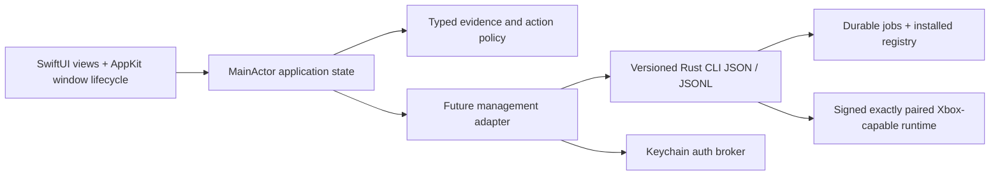

# Architecture

## Boundary

**Implemented:** SwiftPM `XodusCore` typed fixture models/policy, `XodusPreview` SwiftUI/AppKit executable, dependency-free checks, true macOS 26+ system Glass and image-backed original scene resources. There is no management adapter, network transport, Keychain use or runtime invocation in the preview. Optional explicit image exports write only the app's own fixture view artifacts.

**Future:** existing Rust Xodus behind a deliberately new management surface. Existing `xodus-service` runtime IPC must not be treated as account/catalog/install/queue management. No private Rust source is imported into this public app.

## Model and ownership

`ProductID` identifies a catalog product; edition identity, package identity/version, market, language and architecture remain separate. Entitlement is purchase/subscription/none/unknown, with provenance/time and expiry where supplied. Installability is downloadable/blocked/unknown with a reason and pinned package. Compatibility is verified/experimental/unsupported/unknown with OS/architecture/runtime fingerprint. Local installation has its own version/runtime/state; no boolean `supported` or title-string lookup.

The Rust management layer owns authoritative package plans, durable jobs, installed registry, managed-path validation, integrity, staging, atomic promotion and process supervision. Swift owns presentation, user consent, connection/session lifecycle, secure credential broker and event reconciliation. Neither UI cache nor a previous purchase-looking label authorizes a new install.

## Concurrency and persistence

Views observe MainActor state. Future adapters perform process IO and parsing off the main actor with bounded frame sizes and backpressure, then publish validated state updates. A session serializes snapshot/event application; sequence/request/job identifiers reject duplicates and terminal-state regressions. App restart requests durable backend snapshots, not local reconstruction from percentages.

Registry writes use a journal/transaction plus atomic rename and fsync strategy proven on the target filesystem. Entries reference manifest-owned paths and exact package/runtime fingerprints. Saves are external to versioned install roots. Crash-recovery reconciliation quarantines unregistered staged content; it never infers an installed game from a directory name.

## Security and privacy

Consumer inventory consent and token audience are still unresolved, so no speculative live login code exists. Supplied verified backend prior art already has a Keychain token abstraction: `crates/xodus/src/tokens/backend/keychain.rs`, with macOS selection in `crates/xodus/src/secrets.rs` using `apple_native_keyring_store::keychain`. Reuse that abstraction with one credential owner; do not introduce a second incompatible token store. The optional `key-chain-file` feature persists `.xodus-keyring.ron` and must be forbidden in shipping app builds. The diagram's Keychain broker is an interface to this ownership, not a separate vault.

Tokens belong in Keychain and private authenticated channels, never argv, stdout events, stderr or export logs. Request credentials are passed through an authenticated local broker/anonymous pipe or equivalent narrowly scoped channel. Account switch isolates caches/jobs; entitlement revocation follows backend policy. Existing Xbox Live session scopes and configurable XSTS relying party are useful machinery, not proof of inventory audience. Negotiate/document approved auth audience separately per capability; never reuse one XSTS token everywhere.

Runtime downloads must come from an approved manifest with publisher signature, hash, exact engine pairing, capability version and rollback metadata. Validate archives against path traversal/symlink escape, use bounded managed roots, and fail closed on signature/hash mismatch. No auto-downloading arbitrary Wine. Gatekeeper/notarization, hardened runtime/entitlements and component redistribution need a signed release design, not assumptions.

## Failure semantics

Current CLI interactive package prompts must be replaced with explicit requests. Known outer-success/inner-failure and login-without-token hazards mean exit status alone cannot be trusted. Future requests succeed only with validated success envelope and, for installs, verified terminal job/registry state. EOF, invalid JSON, contradictory results, timeout, nonzero exit and missing mandatory fields are explicit failures; sanitized diagnostics are retained for support.

Fixture state deliberately remains in memory and uses no filesystem mutations. That is not a prototype of durable installation; durability is a separate backend gate with fault injection.

## Build and distribution

SwiftPM executable builds using Apple Command Line Tools, targeting a proposed macOS 14 baseline. Available macOS 26+ Glass APIs are used explicitly; older systems have normal-material fallback and reduced transparency has opaque surfaces. Original images are bundled SwiftPM resources, with committed source/provenance. A future `.app` target, icons, signing, notarization, updater, installer and deployment support matrix need decisions and end-to-end validation. Do not ship the unbundled fixture executable as a consumer launcher.
